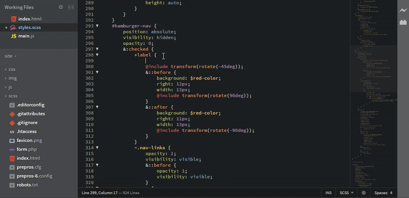
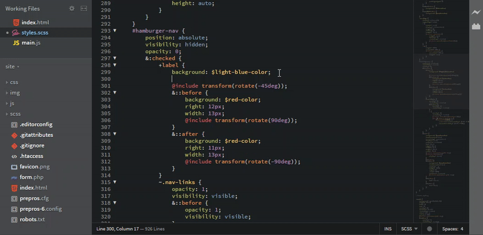
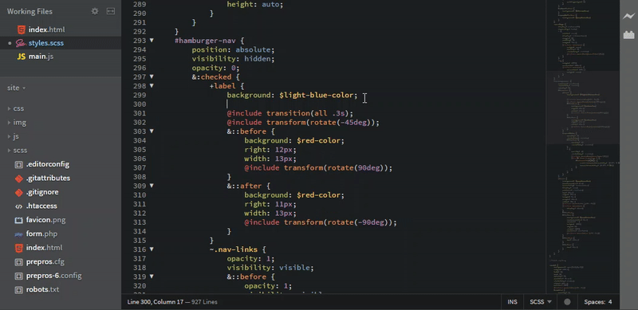

# SASShints (fork by [maximmis](https://github.com/maximmis))
#### Autocompletion for SASS/SCSS variables and mixins in [Brackets](http://brackets.io). Now with added support for color previews

> This is a fork of the original extension by [konstantinkobs](https://github.com/konstantinkobs/brackets-SASShints/issues/3) to add variable and mixin hinting functionality for SASS/SCSS.
This fork and the code changes within it have been created by [DonChillow](https://github.com/DonChillow), [Systaro](https://github.com/Systaro) and [Dularion](https://github.com/Dularion). Color previews via [TinyColor](https://github.com/bgrins/TinyColor).

##Variables



## Mixins
> NOTE: if you start typing **@include**, the hints will be filtered by those letters (ie 'include'), meaning you might not see some of the mixins that you ought to see.
Just type **@** followed by your mixins name, and the list will be filtered. For instance, **@vendo** will find the mixins that include that substring, such as **@mixin vendor-property()**



## Fuzzy search capabilities



## How to use

1. Open a *SASS* or *SCSS* file
2. Write awesome code
3. Press **$** to insert a variable or **@** to insert an @include
4. Get a list of all variables or mixins with their values

## How to install

I'm working on delivering it straight from Bracktes,
but for now there are two possible ways:

1. Copy the url of this repository and paste it into ```File -> Extension Manager -> Install from URL```
2. [Download the code](https://github.com/maximmis/brackets-SASShints/archive/master.zip) and extract it to the Extensions Folder: ```Help -> Show Extension Folder -> user```
