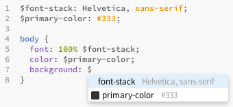
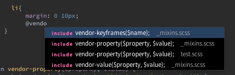

#SASShints
> Autocompletion for SASS/SCSS variables

This extension for [Brackets](http://brackets.io) gives you hints for SASS/SCSS variables and shows what these variables actually are.



It even has fuzzy search capabilities, so you can for example do this:



##How to use

1. Open a *SASS* or *SCSS* file
2. Work with it
3. Press **$** like you do when you want to insert a variable
4. Get a list of all variables with their values

##How to install
There are three possible ways:

1. Install the extension via the Extension Manager in Brackets: ```File -> Extension Manager -> search for 'SASShints'```
2. Copy the url of this repository and paste it into ```File -> Extension Manager -> Install from URL```
3. [Download the code](https://github.com/konstantinkobs/brackets-SASShints/archive/master.zip) and extract it to the Extensions Folder: ```Help -> Show Extension Folder -> user```

##The MIT License (MIT)

Copyright (c) 2014 Konstantin Kobs

Permission is hereby granted, free of charge, to any person obtaining a copy
of this software and associated documentation files (the "Software"), to deal
in the Software without restriction, including without limitation the rights
to use, copy, modify, merge, publish, distribute, sublicense, and/or sell
copies of the Software, and to permit persons to whom the Software is
furnished to do so, subject to the following conditions:

The above copyright notice and this permission notice shall be included in
all copies or substantial portions of the Software.

THE SOFTWARE IS PROVIDED "AS IS", WITHOUT WARRANTY OF ANY KIND, EXPRESS OR
IMPLIED, INCLUDING BUT NOT LIMITED TO THE WARRANTIES OF MERCHANTABILITY,
FITNESS FOR A PARTICULAR PURPOSE AND NONINFRINGEMENT. IN NO EVENT SHALL THE
AUTHORS OR COPYRIGHT HOLDERS BE LIABLE FOR ANY CLAIM, DAMAGES OR OTHER
LIABILITY, WHETHER IN AN ACTION OF CONTRACT, TORT OR OTHERWISE, ARISING FROM,
OUT OF OR IN CONNECTION WITH THE SOFTWARE OR THE USE OR OTHER DEALINGS IN
THE SOFTWARE.