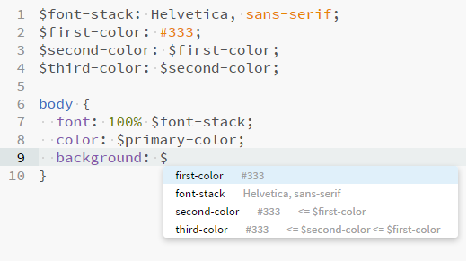

#SASShints (fork by Systaro)
> Autocompletion for SASS/SCSS variables and mixins

####This is a fork of the original extension by [konstantinkobs](https://github.com/konstantinkobs/brackets-SASShints/issues/3) to add mixin-hinting functionality

##### This fork and the code changes within it have been created by [DonChillow](https://github.com/DonChillow) and [Systaro](https://github.com/Systaro).

This extension for [Brackets](http://brackets.io) gives you hints for SASS/SCSS variables and mixins and shows what these variables actually are.


It even has fuzzy search capabilities, so you can for example do this:



##How to use

1. Open a *SASS* or *SCSS* file
2. Work with it
3. Press **$** like you do when you want to insert a variable or **@** like you would start to write @include
4. Get a list of all variables with their values

##Mixins
Beware, if you start typing **@include**, the hints will be filtered by those letters (ie 'include'), meaning you might not see some of the mixins that you ought to see.

You can see this as a feature! just type **@** followed by your mixins name, and the list will be filtered. For instance, **@vendo** will find the mixins that include that substring, such as **@mixin vendor-property()**


##How to install
There are two possible ways (since this is a fork):

1. Copy the url of this repository and paste it into ```File -> Extension Manager -> Install from URL```
2. [Download the code](https://github.com/Systaro/brackets-SASShints/archive/master.zip) and extract it to the Extensions Folder: ```Help -> Show Extension Folder -> user```
